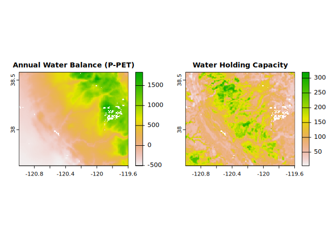
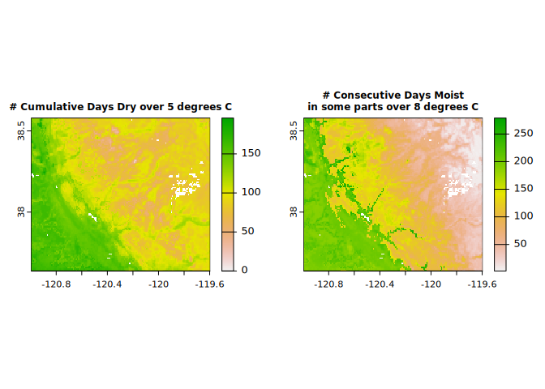
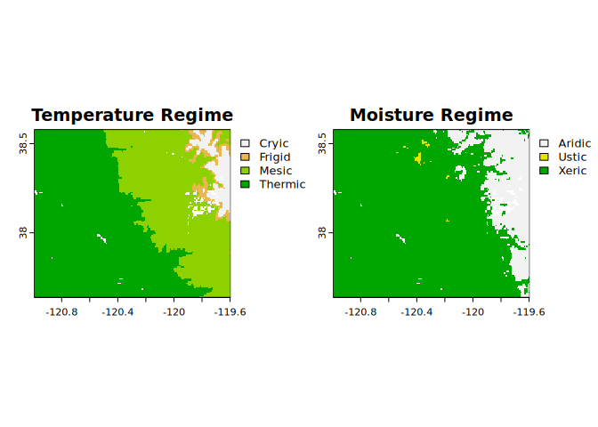
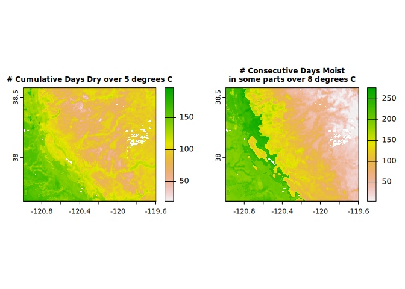

<!-- badges: start -->

<!-- badges: end -->

# {jNSMR}

R wrapper for Java Newhall Simulation Model (jNSM) – “A Traditional Soil
Climate Simulation Model”

Provides methods to create input, read output, and run the routines from
the legacy Java Newhall Simulation Model (jNSM).

## Install {jNSMR}

First, install the development version of the R package. This will
install the latest version of the Java Newhall model JAR (in the {jNSMR}
folder of your package library).

    # install.packages('remotes')
    remotes::install_github('ncss-tech/jNSMR')

## Run batches of models

The jNSM has a defined CSV (comma-separated value) batch file format.
Examples of batch inputs are included in the official download. The
batching in the {jNSMR} package is handled by R code, not Java. The main
interface to batching is `newhall_batch()`.

`newhall_batch()` takes either a character vector of CSV batch file
paths, a data.frame, a SpatRaster or RasterStack/Brick object as input.

### GeoTIFF/SpatRaster Input

    library(jNSMR)
    #> jNSMR (0.3.0) -- R interface to the classic Newhall Simulation Model
    #> Added JAR file (newhall-1.6.5.jar) to Java class path.
    library(terra)
    #> terra 1.7.49

    x <- terra::rast(system.file("extdata", "prism_issr800_sample.tif",
                                 package = "jNSMR"))
    x$elev <- 0 # elevation is not currently used by the model directly

    y <- newhall_batch(x) ## full resolution
    #> newhall_batch: ran n=18790 simulations in 21 secs

    par(mfrow = c(1, 2))

    terra::plot(y$annualWaterBalance, 
                cex.main = 0.9, main = "Annual Water Balance (P-PET)")
    terra::plot(y$waterHoldingCapacity, 
                cex.main = 0.9, main = "Water Holding Capacity")

    terra::plot(y$temperatureRegime, main = "Temperature Regime")
    terra::plot(y$moistureRegime, main = "Moisture Regime")

    terra::plot(y$numCumulativeDaysDryOver5C,
                cex.main = 0.75, main = "# Cumulative Days Dry over 5 degrees C")
    terra::plot(y$numConsecutiveDaysMoistInSomePartsOver8C,
                cex.main = 0.75, main = "# Consecutive Days Moist\nin some parts over 8 degrees C")

    par(mfrow = c(1, 1))

Now let’s try again with ‘Daymet’ monthly climate data at 1 km
resolution. ‘Daymet’ takes a different approach to prediction of
temperature and precipitation so we may expect to see some
differences–but ideally we have good general agreement between the two
models.

    library(jNSMR)
    library(terra)

    x2 <- terra::rast(system.file("extdata", "daymet_issr800_sample.tif",
                                 package = "jNSMR"))
    x2$elev <- 0 # elevation is not currently used by the model directly

    y2 <- newhall_batch(x2) ## full resolution
    #> newhall_batch: ran n=18790 simulations in 20 secs

    par(mfrow = c(1, 2))

    terra::plot(y2$annualWaterBalance, range = c(-750, 1500),
                cex.main = 0.9, main = "Annual Water Balance (P-PET)")
    terra::plot(y2$waterHoldingCapacity, 
                cex.main = 0.9, main = "Water Holding Capacity")

    terra::plot(y2$temperatureRegime, main = "Temperature Regime")
    terra::plot(y2$moistureRegime, main = "Moisture Regime")

    terra::plot(y2$numCumulativeDaysDryOver5C,
                cex.main = 0.75, main = "# Cumulative Days Dry over 5 degrees C")
    terra::plot(y2$numConsecutiveDaysMoistInSomePartsOver8C,
                cex.main = 0.75, main = "# Consecutive Days Moist\nin some parts over 8 degrees C")

    par(mfrow = c(1, 1))

### CSV File Input

Selected example input files have been included in `inst/extdata`
directory of this package.

    pathname <- system.file("extdata/All_PA_jNSM_Example_Batch_Metric.csv", package = "jNSMR")[1]

    res <- data.table::data.table(newhall_batch(pathname, toString = FALSE, verbose = FALSE))

    head(res)
    #>    annualRainfall waterHoldingCapacity annualWaterBalance
    #> 1:        1147.33                  200           474.2701
    #> 2:         932.69                  200           270.1988
    #> 3:        1084.32                  200           427.3922
    #> 4:         992.64                  200           332.5753
    #> 5:        1262.39                  200           629.7745
    #> 6:        1118.09                  200           452.0308
    #>    annualPotentialEvapotranspiration summerWaterBalance
    #> 1:                          673.0599          -69.77925
    #> 2:                          662.4912         -112.88055
    #> 3:                          656.9278          -79.13638
    #> 4:                          660.0647          -88.15085
    #> 5:                          632.6155          -15.91051
    #> 6:                          666.0592         -107.59863
    #>    dryDaysAfterSummerSolstice moistDaysAfterWinterSolstice numCumulativeDaysDry
    #> 1:                          0                          120                    0
    #> 2:                          0                          120                    0
    #> 3:                          0                          120                    0
    #> 4:                          0                          120                    0
    #> 5:                          0                          120                    0
    #> 6:                          0                          120                    0
    #>    numCumulativeDaysMoistDry numCumulativeDaysMoist numCumulativeDaysDryOver5C
    #> 1:                         0                    360                          0
    #> 2:                         0                    360                          0
    #> 3:                         0                    360                          0
    #> 4:                         0                    360                          0
    #> 5:                         0                    360                          0
    #> 6:                         0                    360                          0
    #>    numCumulativeDaysMoistDryOver5C numCumulativeDaysMoistOver5C
    #> 1:                               0                          227
    #> 2:                               0                          226
    #> 3:                               0                          224
    #> 4:                               0                          226
    #> 5:                               0                          212
    #> 6:                               0                          223
    #>    numConsecutiveDaysMoistInSomeParts numConsecutiveDaysMoistInSomePartsOver8C
    #> 1:                                360                                      205
    #> 2:                                360                                      206
    #> 3:                                360                                      204
    #> 4:                                360                                      205
    #> 5:                                360                                      193
    #> 6:                                360                                      203
    #>    temperatureRegime moistureRegime regimeSubdivision1 regimeSubdivision2
    #> 1:             Mesic           Udic              Typic               Udic
    #> 2:             Mesic           Udic              Typic               Udic
    #> 3:             Mesic           Udic              Typic               Udic
    #> 4:             Mesic           Udic              Typic               Udic
    #> 5:             Mesic           Udic              Typic               Udic
    #> 6:             Mesic           Udic              Typic               Udic

## License information

**This package uses a modified version of the Newhall model v1.6.1
(released 2016/02/10) of the jNSM (official download here:
<https://www.nrcs.usda.gov/resources/education-and-teaching-materials/java-newhall-simulation-model-jnsm>)**.
The compiled JAR and source code are distributed in this R package under
the “New” (3-Clause) BSD License. See *LICENSE* for more information.
Modifications to the JAR relative to legacy version facilitate higher
throughput and access to additional data elements.

## System requirements

The system requirements of the extraction and installation tools
(Windows .EXE archive) at the official download link may not be met on
your system, but the core Java class files are stored in a
platform-independent format (a Java JAR file e.g *newhall-1.6.1.jar*)–a
core dependency in this package.

As long as you have a modern Java Runtime Environment (you probably do),
you will be able to run jNSM with only minimal setup.
